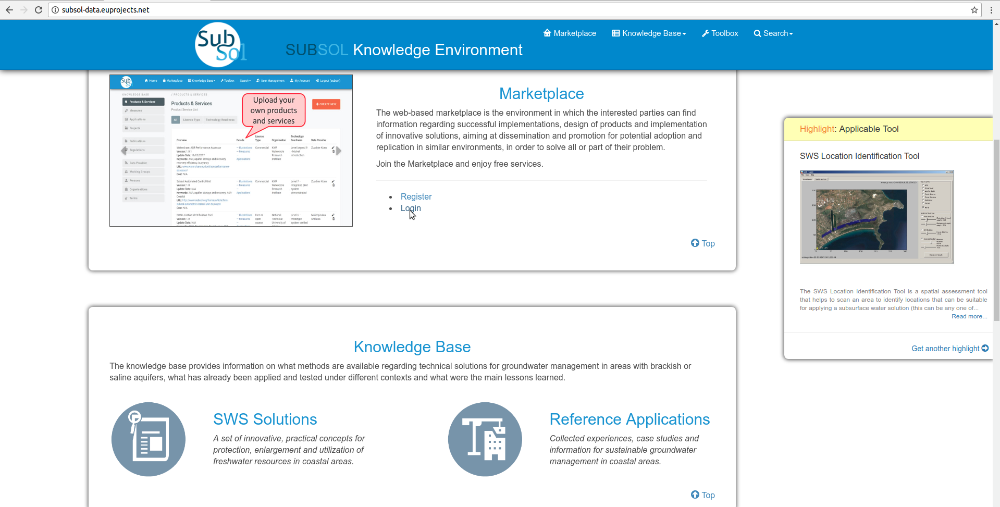
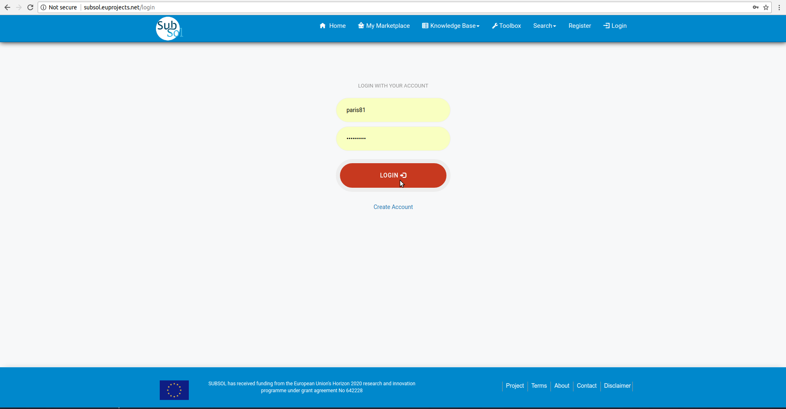
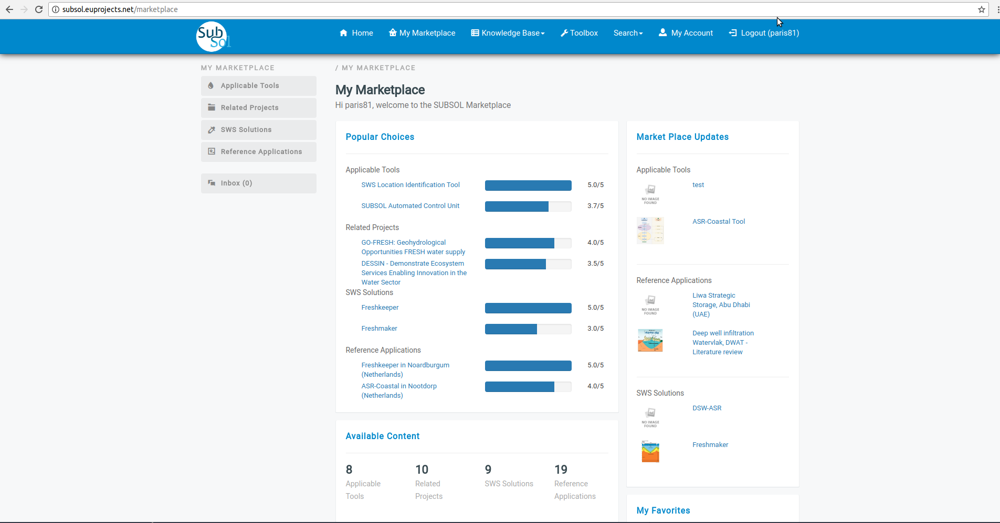
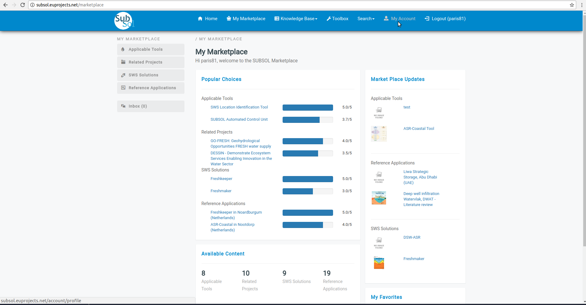
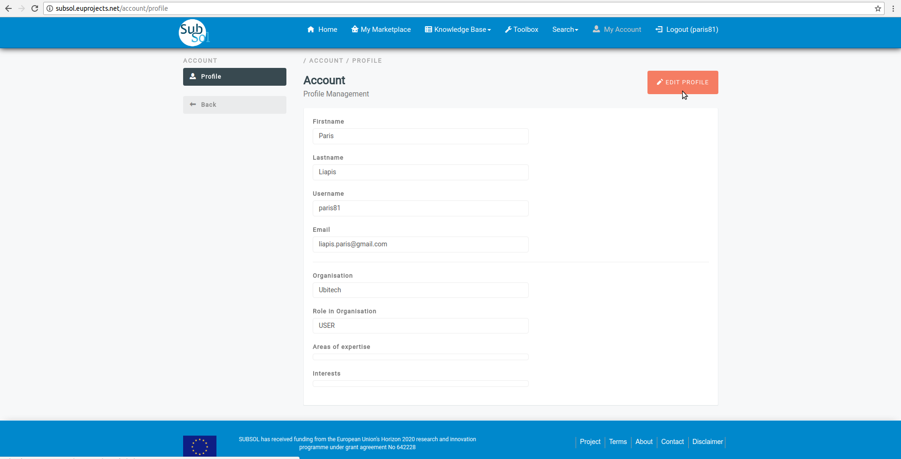
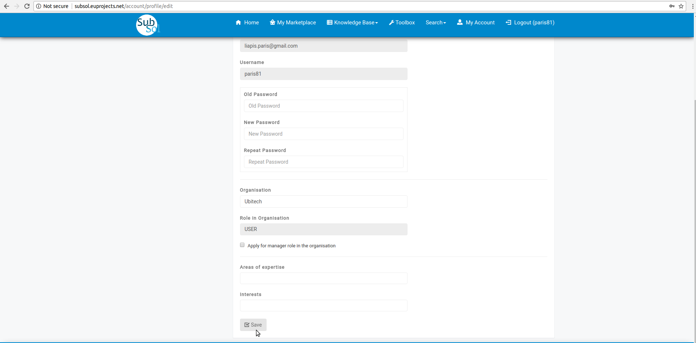
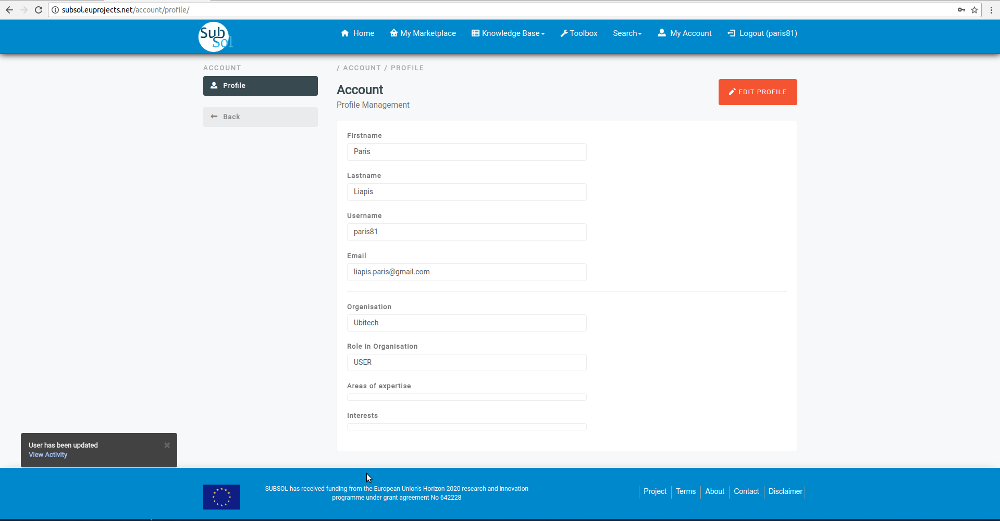

========
Dashboard
========
Access to the platform is provided through the URL
http://subsol-data.euprojects.net/, where the end user is able to view introductory information
regarding the set of services provided through the platform.

.. image:: assets/intro_1.png

Login to account
-----------------

- Click on "LOGIN" button.

- You have successfully "LOGIN" to your account.

Edit account
-------------

- Click on "Edit Profile" button.

- Provide your changes and click on "Save" button.

- A pop-up message confirm that you update successfully your account.

