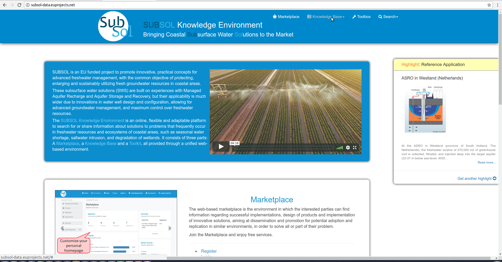
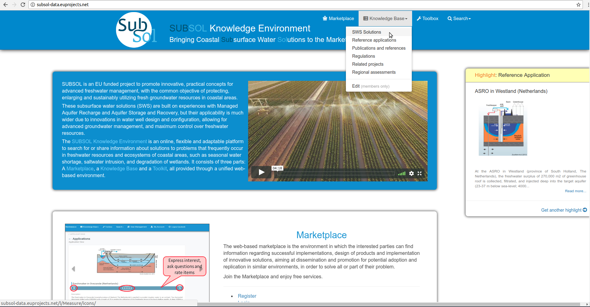
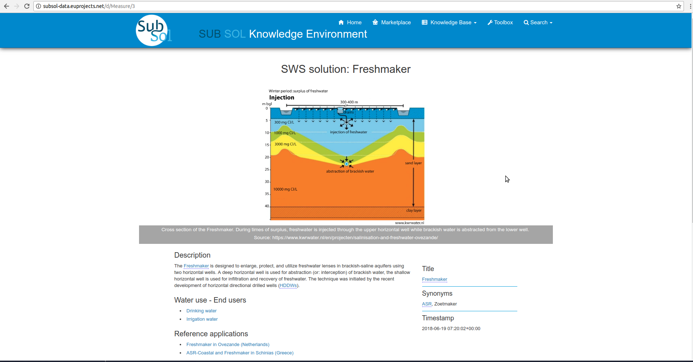
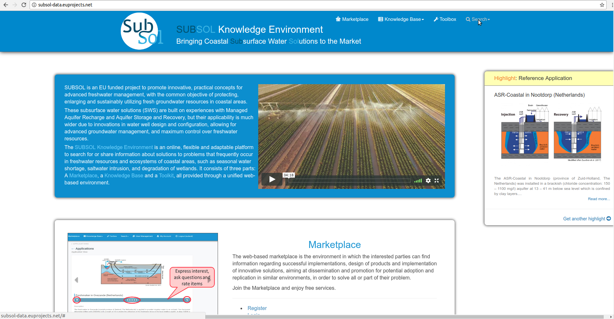
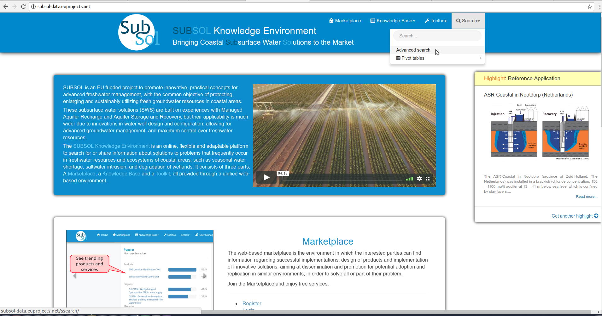
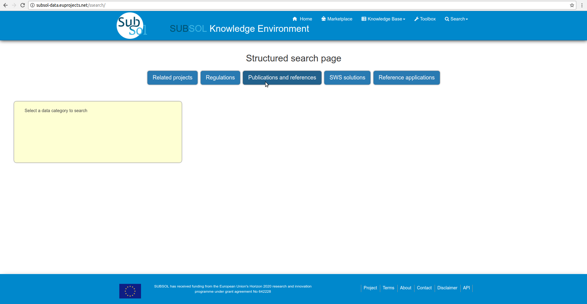
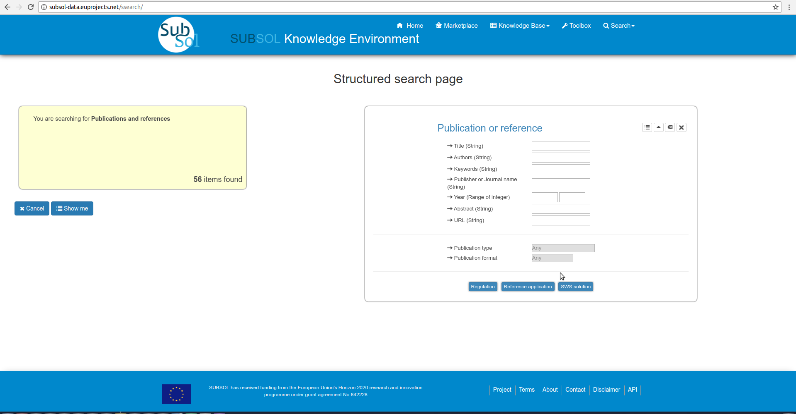
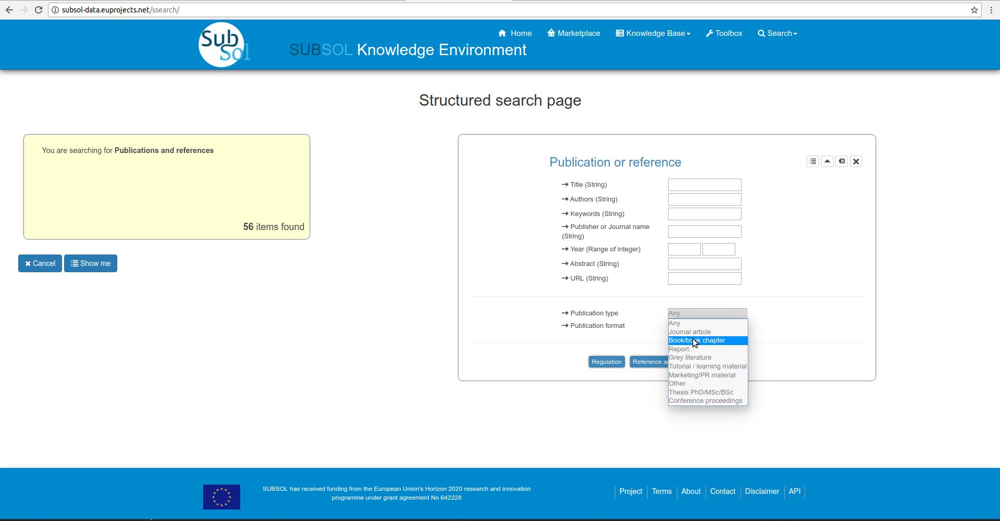
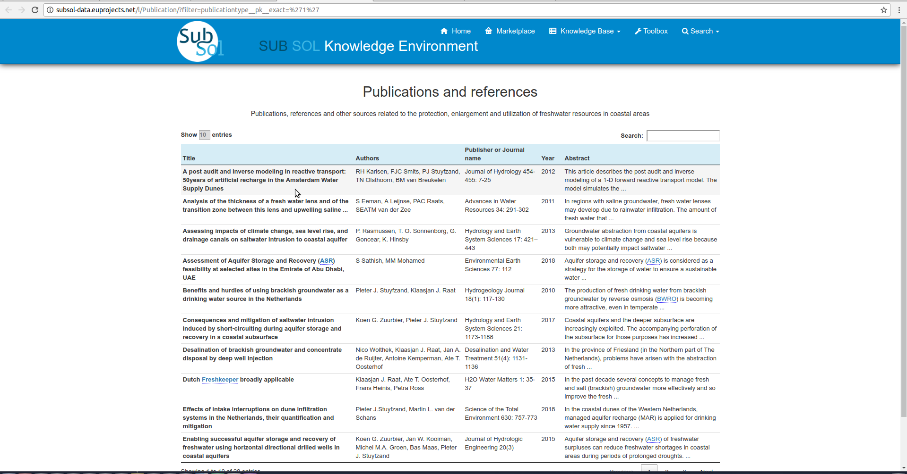
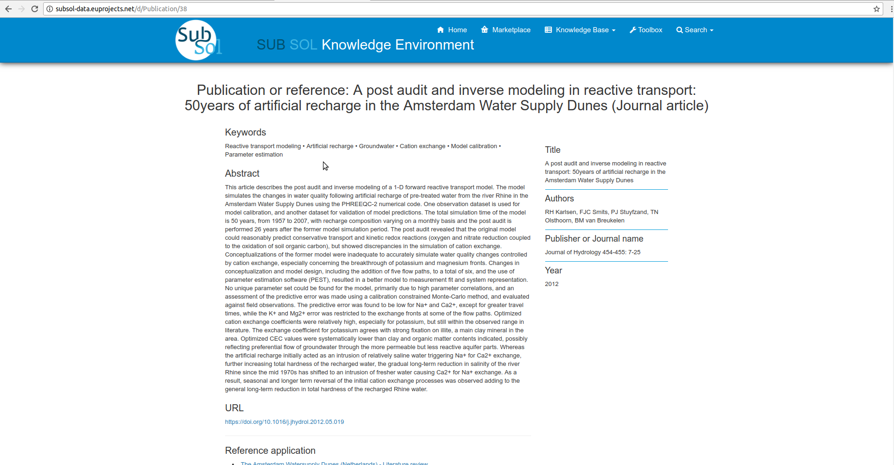

========
Knowledge Base
========
Public Services
----------------

1. Read more

 - Step 1

- Step 2

- Step 3

.. image:: assets/subsol_rm_3.png

- Step 4

.. image:: assets/subsol_rm_4.png

- Step 5

2. Search

 2.1 Advance search

 - Step 1

- Step 2

- Step 3

- Step 4

- Step 5

- Step 6

- Step 7

3. Pivot Tables

Private Services
----------------------

 1. Categories

- Add Content

- Modify Content

2. Applicable Tools

 - Licence Type

 - Technology Read
