========
Knowledge Base
========
Public Services
----------------

**1. Read more**

- Step 1

.. image:: assets/subsol_rm_1.png

- Step 2

.. image:: assets/subsol_rm_2.png

- Step 3

.. image:: assets/subsol_rm_3.png

- Step 4

.. image:: assets/subsol_rm_4.png

- Step 5

.. image:: assets/subsol_rm_5.png

**2. Search**

*2.1 Advance search*

- Step 1

.. image:: assets/subsol_as_1.png

- Step 2

.. image:: assets/subsol_as_2.png

- Step 3

.. image:: assets/subsol_as_3.png

- Step 4

.. image:: assets/subsol_as_4.png

- Step 5

.. image:: assets/subsol_as_5.png

- Step 6

.. image:: assets/subsol_as_6.png

- Step 7

.. image:: assets/subsol_as_7.png

**3. Pivot Tables**

- Step 1

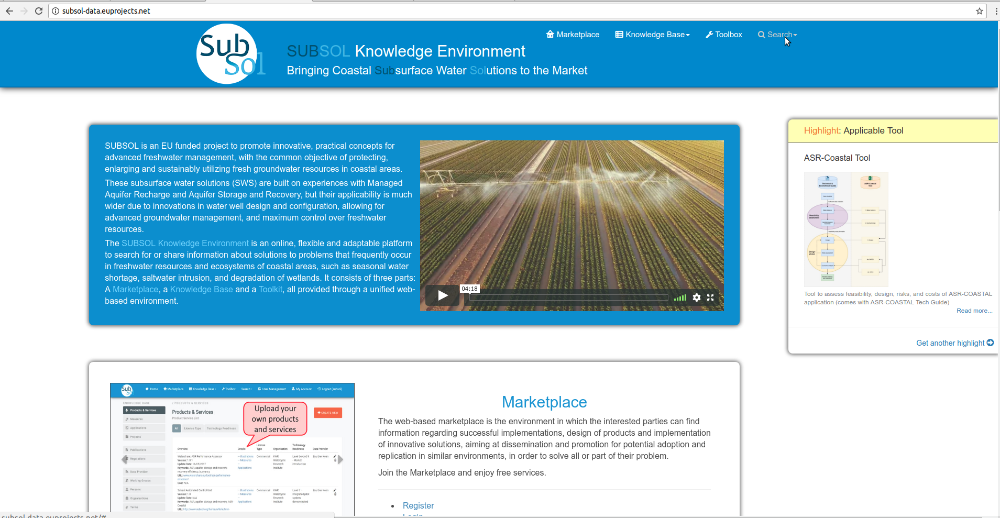

- Step 2

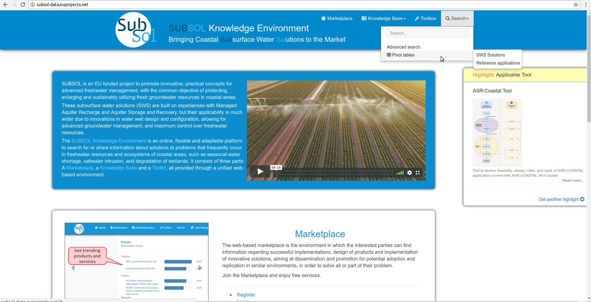

- Step 3

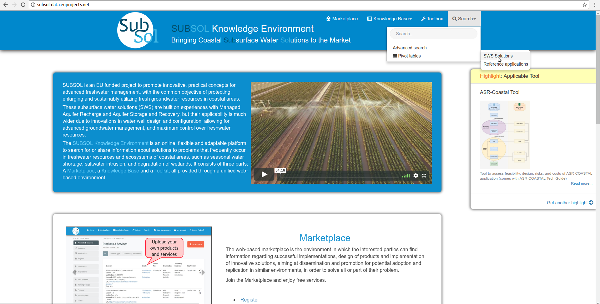

- Step 4

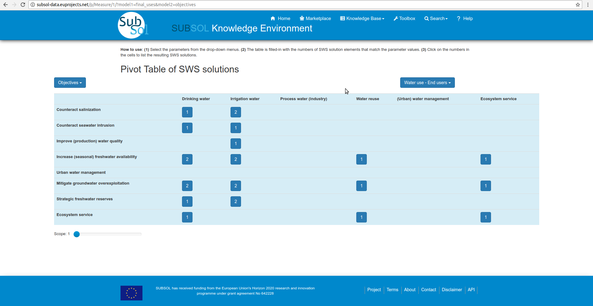

- Step 5 

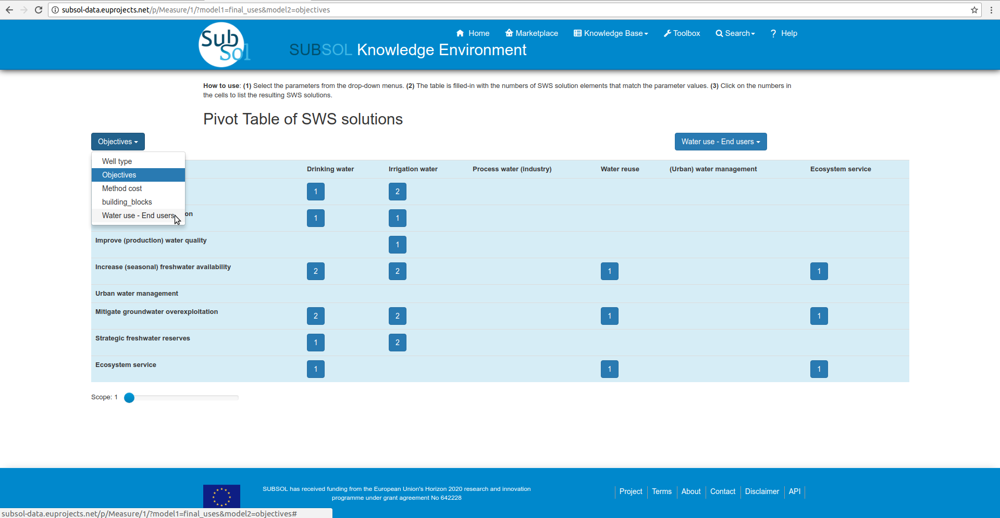

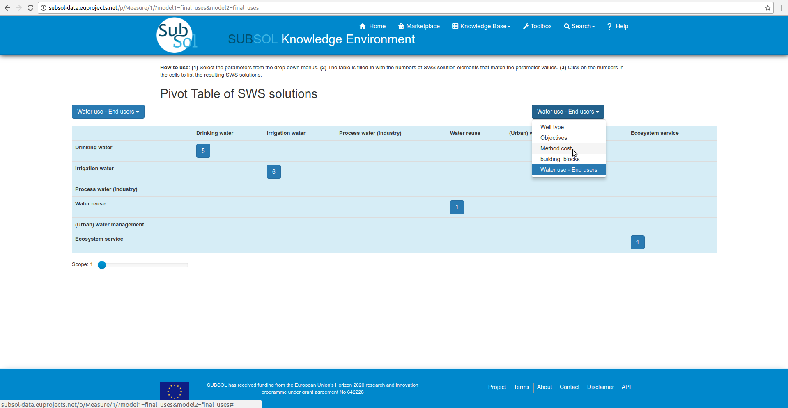

- Step 6

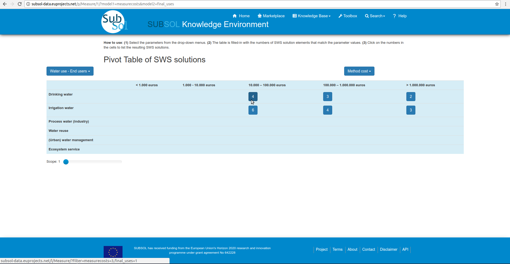

- Step 7

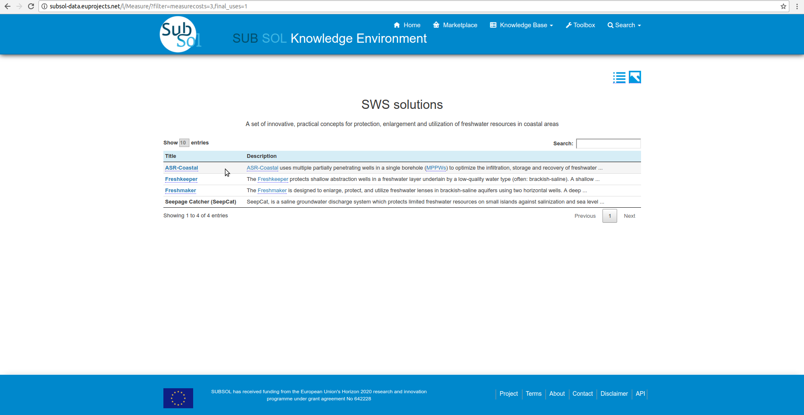

Private Services
----------------------

**1. Categories**
 
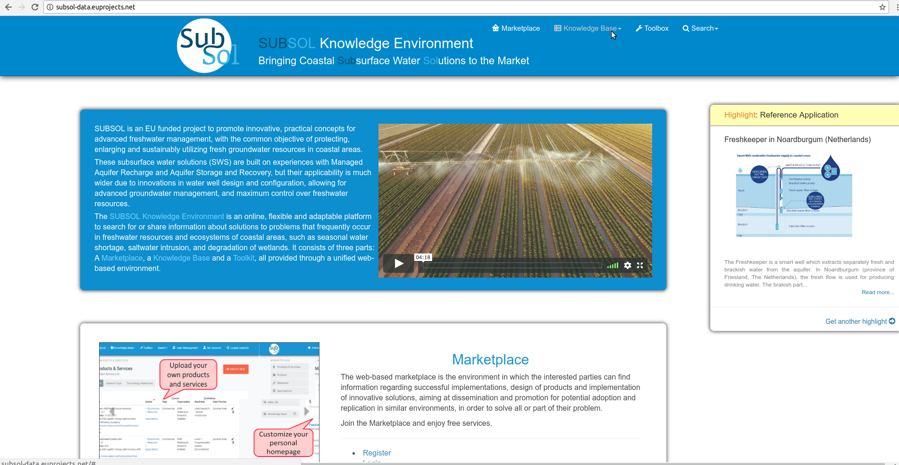
 
 - Step 2
 
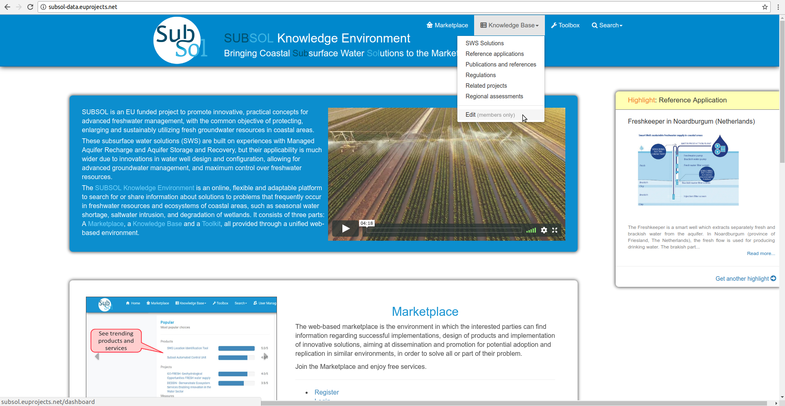
 
 - Step 3
 
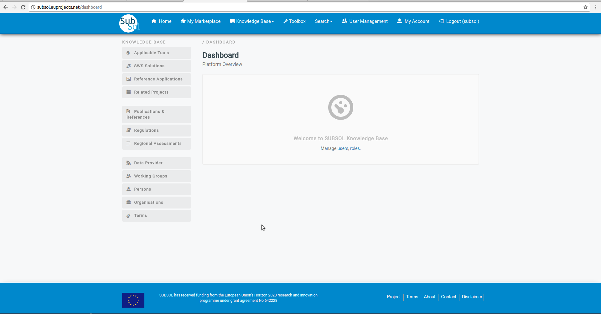

- Add Content

- Step 1

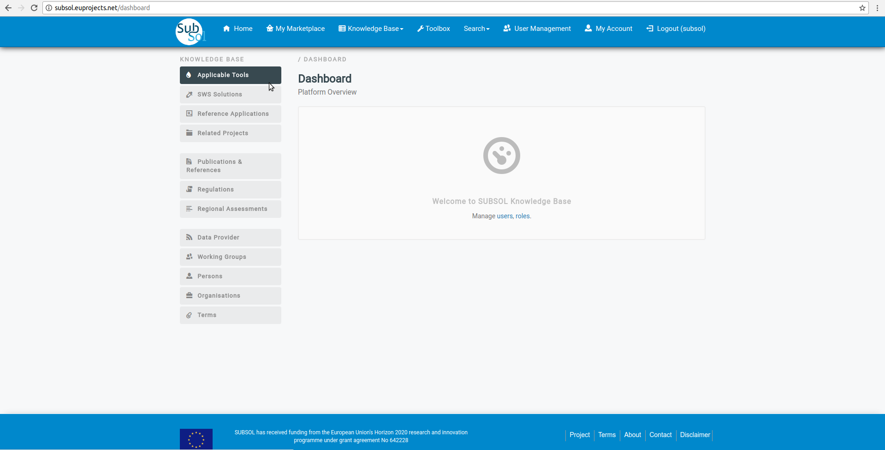

- Step 2

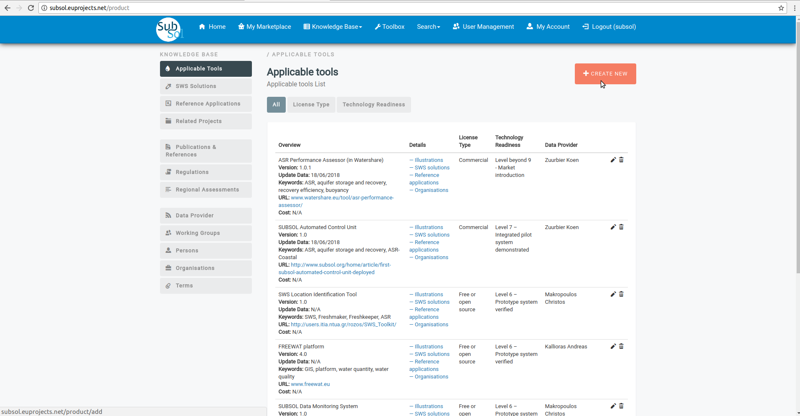

- Step 3

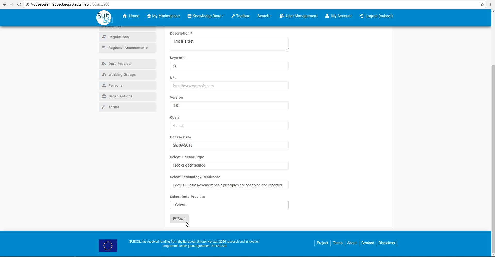

- Step 4

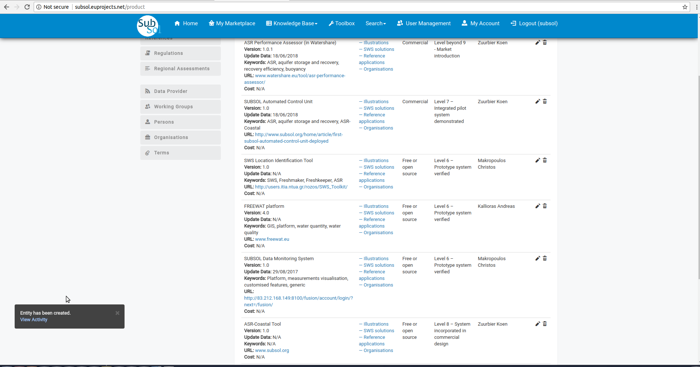

- Modify Content

- Step 1

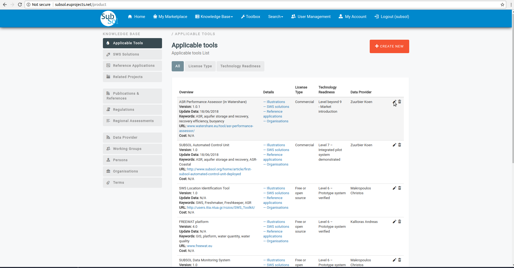

- Step 2

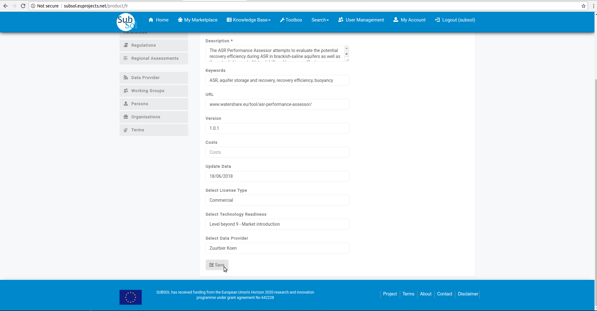

- Step 3 

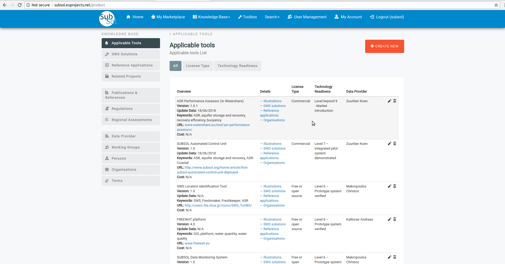

**2. Applicable Tools**

- Licence Type

- Technology Read
