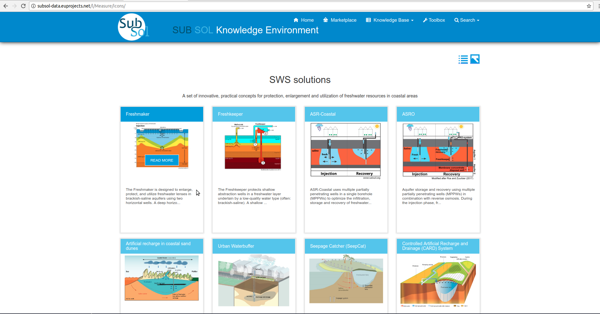

========
Knowledge Base
========
Public Services
----------------

**1. Workflow**

- Click on the "Knowledge Base" drop-down list.

.. image:: assets/subsol_rm_1.png

- Select the preferred category from the dropdown list. (In this use case "SWS SOLUTIONS")

.. image:: assets/subsol_rm_2.png

- Select an item to view detailed information.

- Click on "Read More" button.

.. image:: assets/subsol_rm_4.png

- View full information available for this item.(In this use case "Freshmaker.")

**2. Search**

*2.1 Advanced search*

- Click on "Search" button.

.. image:: assets/subsol_as_1.png

- Select the "Advanced Search" opton from dropdown list.

.. image:: assets/subsol_as_2.png

- Select a data category to search.

- Provide Search criteria.

- Select an item from the search results.

- View full information available for this item.

.. image:: assets/subsol_as_7.png

**3. Pivot Tables**

- Click on "Search" button.

.. image:: assets/subsol_pt_1.png

- Click on "Pivot Tables".

.. image:: assets/subsol_pt_2.png

- Select the preferred category from the dropdown list. (In this use case "SWS SOLUTIONS").

- Select the preferred parameters from dropdown lists.

.. image:: assets/subsol_pt_5.png

- Click on prefered results.

- Click on relevant item and view details.

.. image:: assets/subsol_pt_8.png

Private Services
----------------------

**1.Categories**

- Initially the user must login with private account privileges.

.. image:: assets/subsol_c_1.png

- Click on "Edit".

- The desired Knowledge base category are at left menu.

**Add Content**

- Click on desired menu-item (in this case Application Tools).

- Click on "CREATE NEW" button.

.. image:: assets/subsol_ac_2.png

- Provide your info and click on "Save" button.

- A pop-up message confirms that you have successfully create your new entry.

.. image:: assets/subsol_ac_4.png

**Modify Content**

- Click on "Modify" pencil-item.

- Provide your changes and click on "Save" button.

.. image:: assets/subsol_mc_2.png

- A pop-up message confirms that you have successfully create your new entry.

.. image:: assets/subsol_mc_3.png

**2.Applicable Tools**

*2.1. Licence Type*

- Click on "Licence Type" menu-item

.. image:: assets/subsol_lt_1.png

- Click on "CREATE NEW" button.

.. image:: assets/subsol_lt_2.png

- Provide licence type info and click on "Save" button.

- A pop-up message confirms that you have successfully create your new licence type.

- Edit Licence Type

- Click on "Modify" pencil-item.

- Provide your changes and click on "Save" button.

- A pop-up message confirms that you have successfully update your licence type.

*2.2 Technology Readiness*

- Add Technology Readiness

- Click on "Technology Readiness" menu-item.

- Click on "Create New" button.

- Provide your credentials and click on "Save" button.

- A pop-up message confirms that you have successfully create a new Technology Readiness entry.

- Edit Technology Readiness

- Click on "Modify" pencil-item.

- Provide your changes and click on "Save" button.

- A pop-up message confirms that you have successfully update your Technology Readiness entry. .

