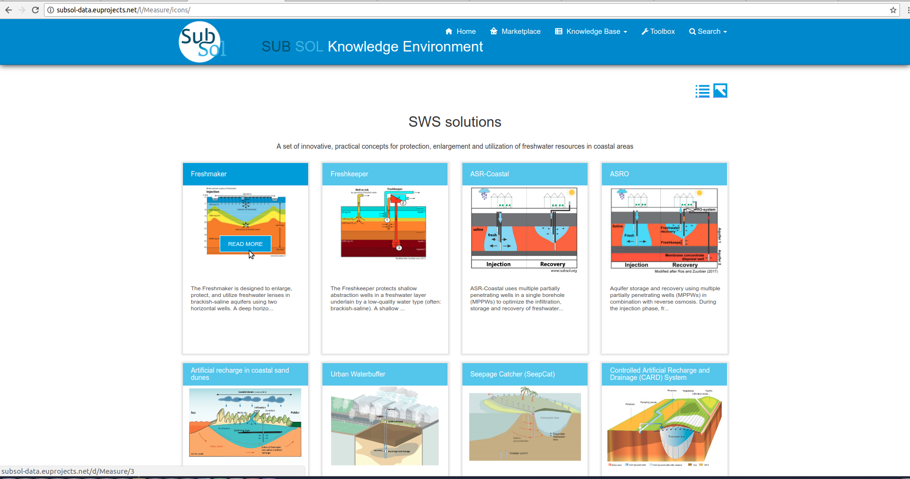

========
Knowledge Base
========
Public Services
----------------

**1. Read more**

- Step 1

- Step 2

- Step 3

.. image:: assets/subsol_rm_3.png

- Step 4

- Step 5

.. image:: assets/subsol_rm_5.png

**2. Search**

*2.1 Advance search*

- Step 1

- Step 2

- Step 3

.. image:: assets/subsol_as_3.png

- Step 4

- Step 5

.. image:: assets/subsol_as_5.png

- Step 6

.. image:: assets/subsol_as_6.png

- Step 7

**3. Pivot Tables**

- Step 1

- Step 2

- Step 3

.. image:: assets/subsol_pt_3.png

- Step 4

- Step 5 

.. image:: assets/subsol_pt_6.png

- Step 6

.. image:: assets/subsol_pt_7.png

- Step 7

Private Services
----------------------

**1.Categories**
 

 
- Step 2
 
.. image:: assets/subsol_c_2.png
 
- Step 3
 
.. image:: assets/subsol_c_3.png

**Add Content**

- Step 1

.. image:: assets/subsol_ac_1.png

- Step 2

- Step 3

.. image:: assets/subsol_ac_3.png

- Step 4

**Modify Content**

- Step 1

.. image:: assets/subsol_mc_1.png

- Step 2

- Step 3 

**2.Applicable Tools**

**2.1. Licence Type*

- Add Licence Type
  
 - Step 1

- Step 2

- Step 3

.. image:: assets/subsol_lt_3.png

- Step 4
    
.. image:: assets/subsol_lt_4.png

- Edit Licence Type

- Step 1

.. image:: assets/subsol_lt_5.png

- Step 2
    
.. image:: assets/subsol_lt_6.png

- Step 3

.. image:: assets/subsol_lt_7.png

*2.2 Technology Read*

- Step 1

