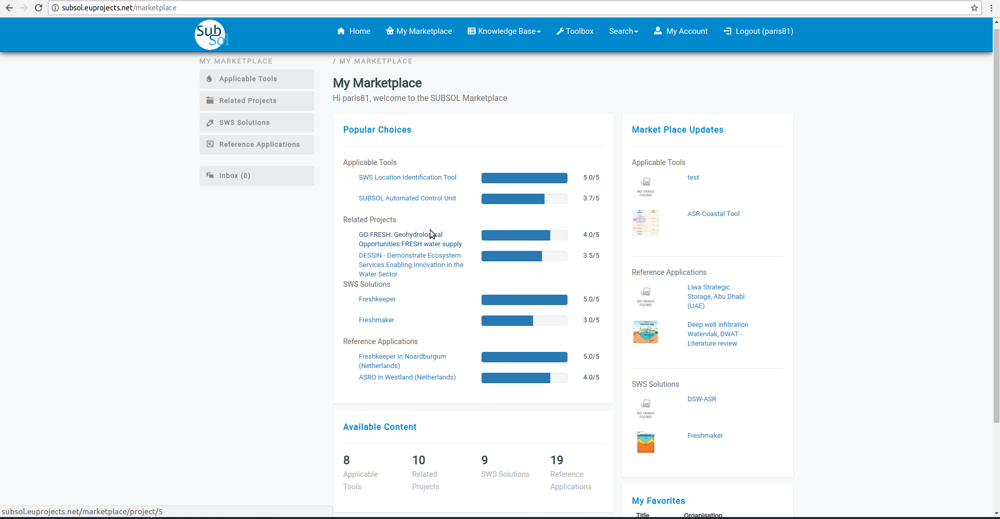
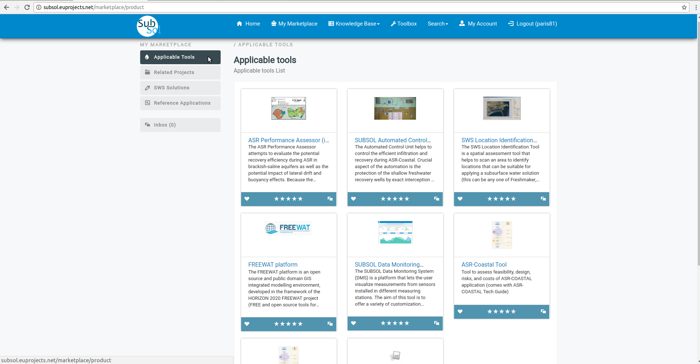
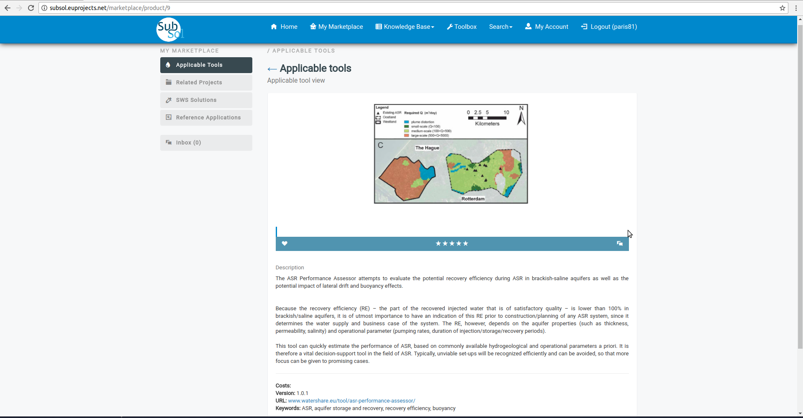
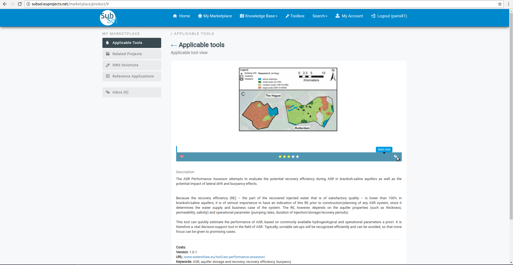
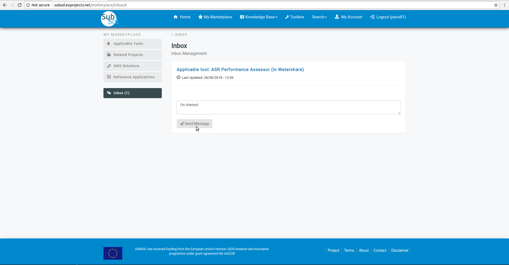
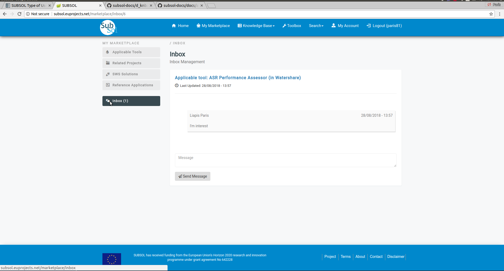
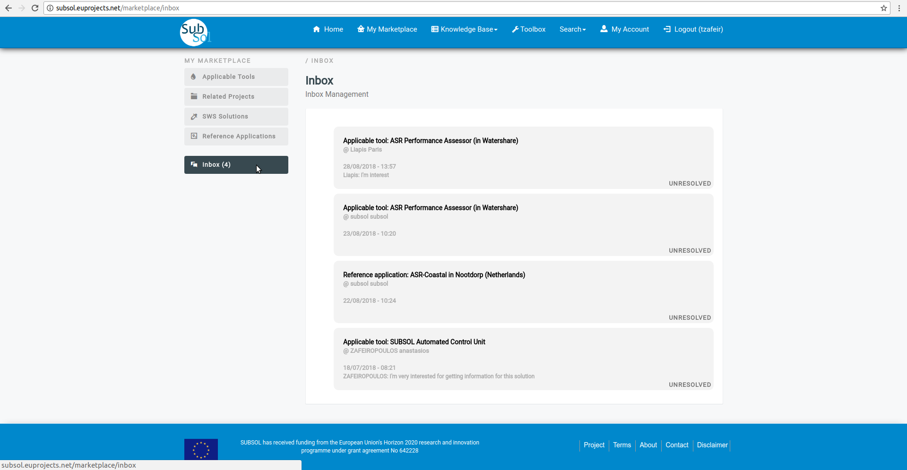
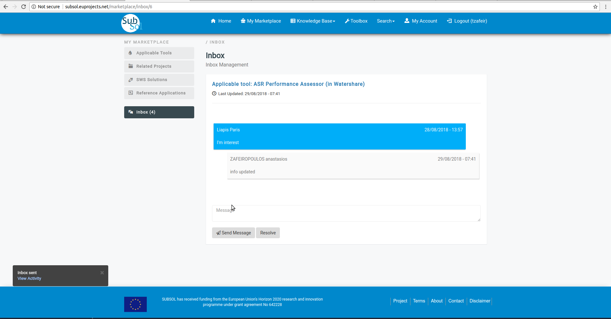
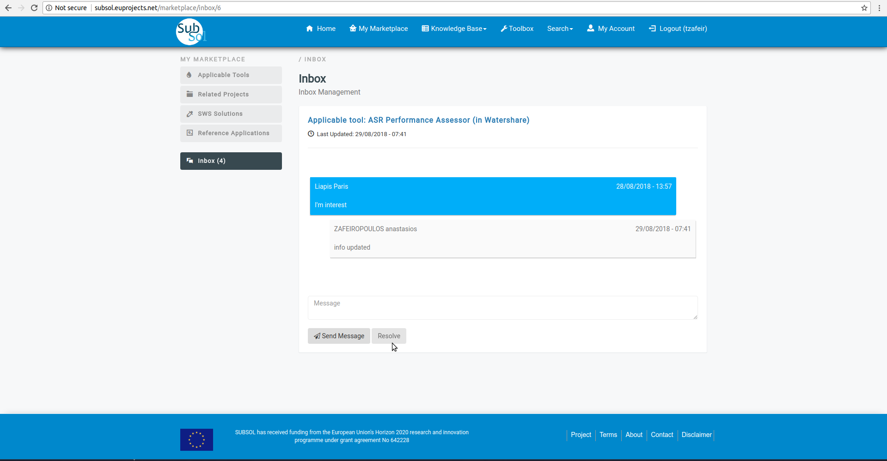

Marketplace
========
Organization Representative
----------------
Simple User
----------

**1. Dashboard**

- Click on "Marketplace" Menu-item.

.. image:: assets/subsol_mar_1.png

- The user can review the marketplace area.

**2. Applicable Tools**

*2.1 Open*

- Click on preferred icon view from applicable list.

.. image:: assets/subsol_mar_5.png

-  View full information available for this item.

*2.2 Rate a product*

- Click on "Rate a product" stars to evaluate it.

.. image:: assets/subsol_mar_7.png

*2.3 Add to Favorites*

- Click on "heart" button to add this product to favorites.

.. image:: assets/subsol_mar_8.png

*2.4. Chat*

- Click on "Start Chat" button.

- Provide your message and click on "save" button.

- You have successfully send your message to Manager.

Manager
----------

**1. Manager View**

.. image:: assets/subsol_mar_1.png

- Initially the user must login with manager account privileges.

.. image:: assets/subsol_mms_1.png

**2. Inbox**

*2.1. Send Messages*

- Click on "inbox" menu-item.

- Write your answer and click on "Send Message" menu-item.

.. image:: assets/subsol_mms_3.png

- A pop-up message confirms that you have successfully send your answer.

*2.2. Resolve Issue*

- Click on "Resolve" button.

- A pop-up message confirms that you have successfully update your chat status.

.. image:: assets/subsol_mms_5.png
